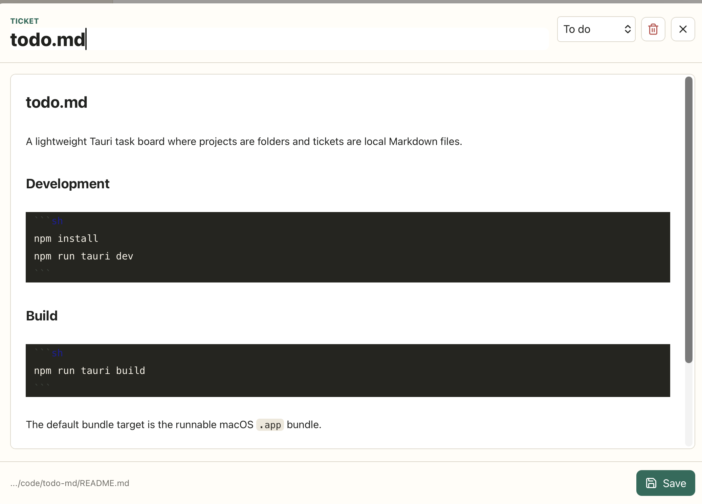
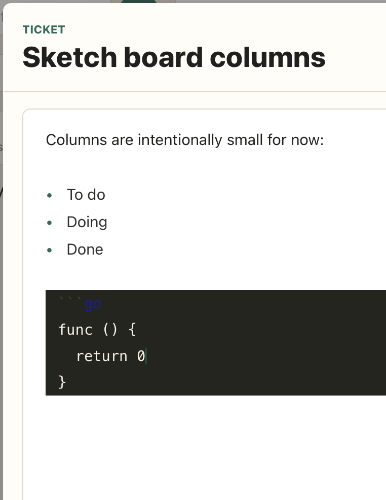
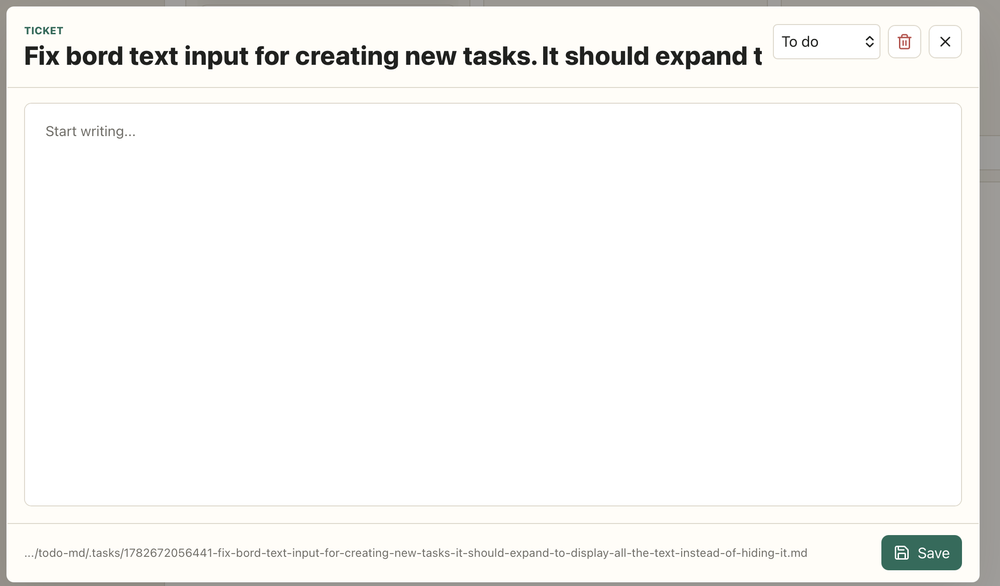

The background of the text editor is white and stands out. I'm also not a fan of the font, it's too skinny, pick something nicer and more fun.

When editing a code block the contrast is super bad and it’s barely readable

If task title is too long it should expand to new line, not hide it.


