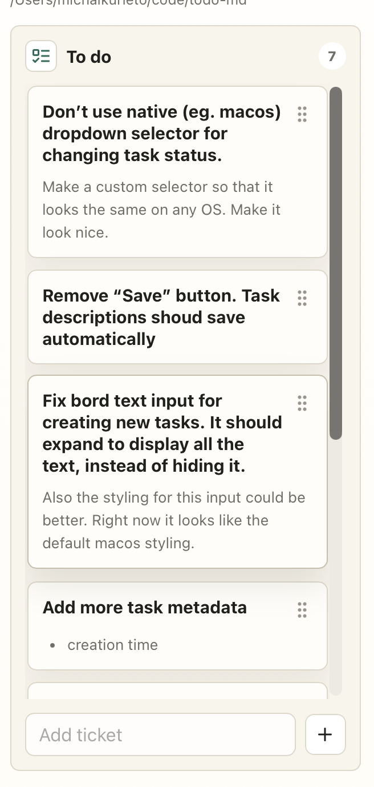
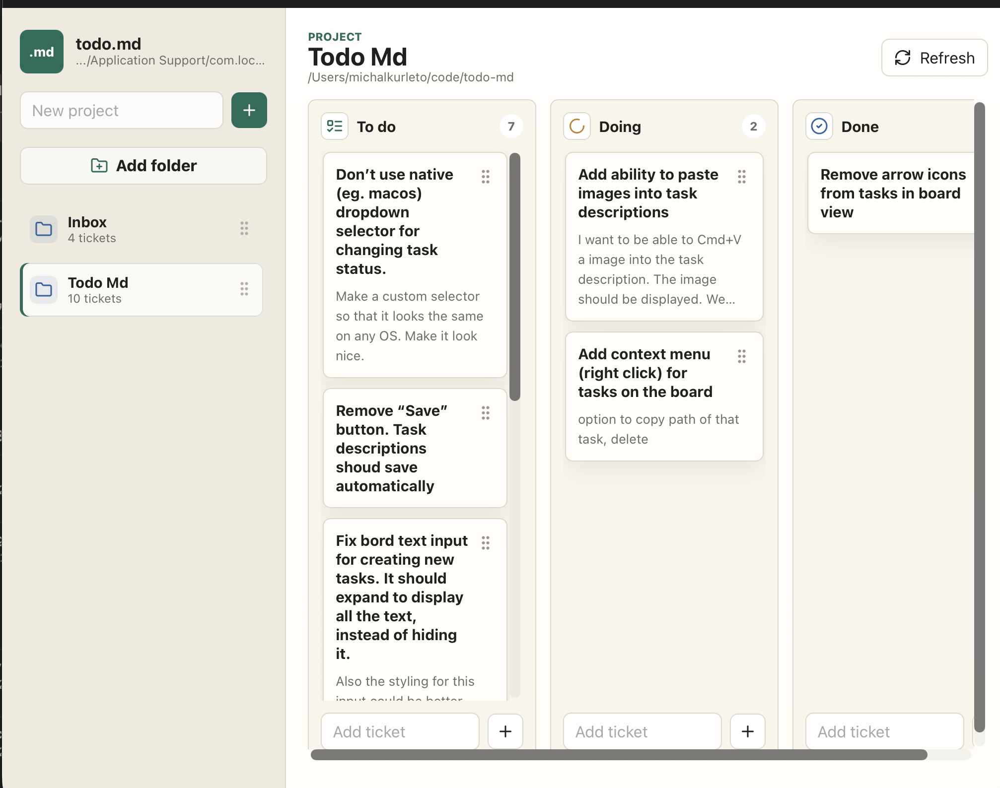

Scroll bar is too big, and too close to the tasks. I don’t even know if we need to show a scroll bar, I think we should hide it completely.

Same for all the other scroll bars:

I’d rather that the app have a min size and can’t shrink below that.
