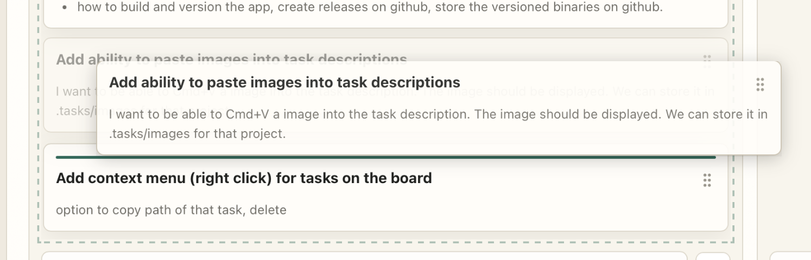

When dragging task to change order the line should show up between tasks indicating where the task will be places, not on top of the task card below it (like on the screenshot).

There's also this crazy flickering sometimes when i hold a card.
